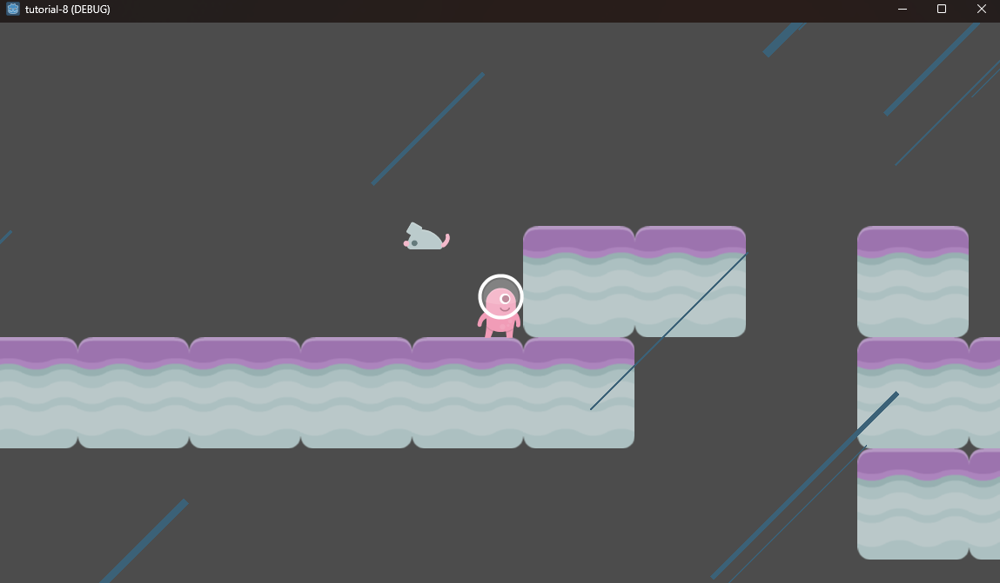

# Tutorial 8 - Game Polishing & Balancing

Pada tutorial ini, saya belajar membuat particle hujan dan trail pada player untuk polishing game. Tutorial kali ini cukup sederhana, resource dari tutorial sudah cukup untuk mengerjakan latihan-latihannya.

## Membuat Particle Hujan

Particle dibuat menggunakan node `GPUParticles2D`. Untuk particle hujan, ada beberapa atribut yang perlu di-setting, seperti:

- Amount particle dibuat banyak agar mirip dengan rintik hujan
- Lifetime dari particle diperpanjang agar bertahan lama di layer
- Scale dibuat bervariasi
- Mengubah emission shape menjadi box (persegi panjang), agar terlihat seperti rintik hujan yang sedang jatuh
- Ubah warna menjadi kebiruan
- Ubah gravitasi particle untuk menentukan arah hujan dan mengatur spread agar persebaran particle tidak terlalu jauh
- Mengatur drawing area agar particle muncul di seluruh map
- Menyalakan atribut trail agar partikel hujan memiliki ekor

## Membuat Trail Saat Player Berjalan

Trail juga menggunakan node `GPUParticles2D`, tetapi kita menambahkannya pada scene Player. Kita menggunakan texture dari asset yang sudah disediakan. Berbeda dengan hujan, kita tidak perlu terlalu banyak particle dan particle juga tidak perlu terlalu lama berada di layar. Implementasinya mirip-mirip dengan particle hujan, hanya disesuaikan saja untuk particle trail berjalan. Kita juga perlu merubah kode movement player seperti yang ada pada tutorial agar trail player tidak muncul saat sedang diam.

## Game Balancing

Awalnya tikus muncul dengan jumlah yang sangat banyak, sehingga player tidak dapat menyelesaikan permainan. Setelah coba-coba, nilai `spawn_rate = 2` cukup balanced dan player dapat menyelesaikan permainannya dengan sedikit problem solving. Player perlu bersembunyi sebentar di balik tebing dan menunggu timing yang tepat untuk melompat.

